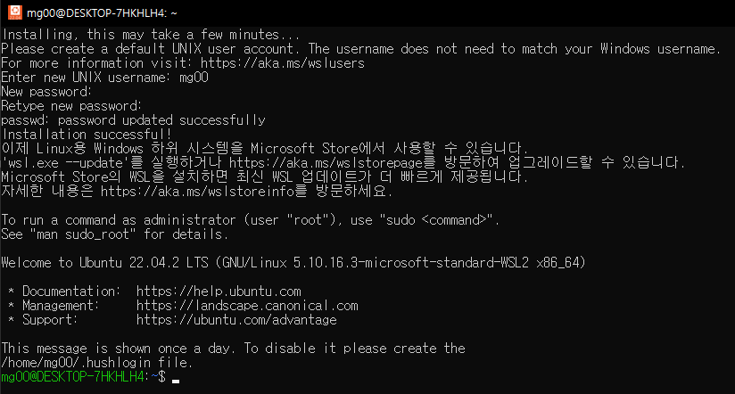

# WSL2에 Ubuntu 설치 및 터미널 커스터마이징

<aside>
💡 **made by mingi**

</aside>

# 1. WSL 활성화

cmd나 Windows PowerShell을 관리자 권한으로 실행한다.

그리고 아래 명령어를 차례대로 입력한다.

```bash
dism.exe /online /enable-feature /featurename:Microsoft-Windows-Subsystem-Linux /all /norestart
dism.exe /online /enable-feature /featurename:VirtualMachinePlatform /all /norestart
```

그 후에 PC를 재부팅해준다.

# 2. WSL2 Linux 커널 업데이트

본인 PC의 CPU 아키텍쳐에 맞춰 설치파일을 다운로드 한다.

x64 : [https://wslstorestorage.blob.core.windows.net/wslblob/wsl_update_x64.msi](https://wslstorestorage.blob.core.windows.net/wslblob/wsl_update_x64.msi)

ARM64 : [https://wslstorestorage.blob.core.windows.net/wslblob/wsl_update_arm64.msi](https://wslstorestorage.blob.core.windows.net/wslblob/wsl_update_arm64.msi)

혹시 안되면 [https://learn.microsoft.com/ko-kr/windows/wsl/install-manual](https://learn.microsoft.com/ko-kr/windows/wsl/install-manual) 의 4단계 참고하기

여기서 설치를 안하면 나중에 Ubuntu 실행 시에 “WslRegisterDistribution failed with error: 0x800701bc" 라고 뜨면서 실행이 안된다.)

설치가 완료되면 터미널에서 아래 명령어를 입력한다.

```powershell
wsl --set-default-version 2
```

# 3. Microsoft Store에서 원하는 Ubuntu 앱 설치

Microsoft Store에서 원하는 우분투 버전을 설치한다. 

※ 만약에 실행 시 "WslRegisterDistribution failed with error: 0xc03a001a" 라고 뜬다면 아래 블로그 참고하기. [https://goaloflife.tistory.com/193](https://goaloflife.tistory.com/193)

# 4. 정상 실행 결과



이때 Hyper-V 옵션을 설정하지 않고 그냥 진행했을때 되었는데, Window 11 에서는 옵션 설정을 해주어야 하는 것 같다. 검색에 Windows 기능 켜기/끄기를 검색해서 설정을 보면 Hyper-V와 가상 머신 플랫폼이 있다. 나는 Hyper-V 말고 가상 머신 플랫폼만 켜져있었다.


Hyper-V 와 가상 머신 플랫폼의 차이는 더 알아봐야 할 것 같다. 
참고 : [https://superuser.com/a/1619173](https://superuser.com/a/1619173)

만약 정상적으로 설치된 지 궁금하다면 터미널에서 아래 명령어를 사용하여 확인할 수 있다.

```bash
wsl -l -v
```


# 5. Windows Terminal로 WSL2 사용하기

Windows Terminal 은 WSL2도 기본적으로 지원한다. Microsoft Store에서 설치하자.

참고 : [https://www.lainyzine.com/ko/article/how-to-install-windows-terminal-powershell-wsl2/](https://www.lainyzine.com/ko/article/how-to-install-windows-terminal-powershell-wsl2/)


아무 설정 없이 Ubuntu를 실행할 수 있다.

# 6. zsh 설치하기

우선 아래 명령어들을 입력한다.

```bash
sudo apt update
sudo apt upgrade
sudo apt install zsh
```

이제 zsh를 더 편하게 꾸미는 oh-my-zsh를 설치한다.

```bash
sh -c "$(wget -O- https://raw.githubusercontent.com/ohmyzsh/ohmyzsh/master/tools/install.sh)"
```


zsh의 테마를 익숙한 agnoster로 바꿔주자.

```bash
vi ~/.zshrc
# ZSH_THEME="agnoster” 로 바꿔주자.
# vi에서 수정하려면 I(insert) 누른 후에 바꿔주고 
# esc를 누른 뒤에 :wq(저장하고 나가기)를 입력해준다.
source ~/.zshrc
```

테마가 바뀌었지만 폰트가 깨지게 된다.

https://github.com/naver/d2codingfont/releases/tag/VER1.3.2

네이버에서 만든 D2Coding 폰트를 다운받는다. 터미널이나 코드를 짤때 한글 입력이 자연스럽고 깨지지 않는다. ligature은 “합자”를 의미하는데 >= 를 ≥ 로 사용하는 걸 말한다.

Windows Terminal 에서 폰트를 바꾸어주자. (맥북은 이쁜 폰트들이 많다 예를들어 melno!)


# 7. zsh plugins 설치하기

### zsh-autosuggestions

이 플러그인은 이전에 입력했던 명령을 기반으로 명령을 타이핑 할 때마다 자동 완성을 제공하고 방향키로 해당 자동 완성을 사용할 수 있게 해준다.

```bash
git clone https://github.com/zsh-users/zsh-autosuggestions ${ZSH_CUSTOM:-~/.oh-my-zsh/custom}/plugins/zsh-autosuggestions
```

위 명령어로 설치하고 ~/.zshrc 파일 안에 있는 plugins에 `zsh-autosuggestions` 를 추가해준다.


### syntax highlighting

이 플러그인은 명령어에 구문 강조를 적용해준다. 구문 강조가 적용되면 좋은 것 중 하나는 특정 명령을 사용할 수 있으면 녹색으로, 설치 되지 않음 등의 이유로 알 수 없는 명령이면 빨간색으로 나타난다.

```bash
git clone https://github.com/zsh-users/zsh-syntax-highlighting.git ${ZSH_CUSTOM:-~/.oh-my-zsh/custom}/plugins/zsh-syntax-highlighting
```

위 명령어로 설치하고 ~/.zshrc 파일 안에 있는 plugins에 `zsh-syntax-highlighting` 를 추가해준다.

### autojump

이 플러그인은 cd를 안쓰고 j로 바로 특정 디렉토리로 갈 수 있다. 하지만 꼭 한번은 방문해야 그 디렉토리로 갈 수 있다. `autojump -s` 로 방문한 디렉토리 기록을 볼 수 있다.

```bash
sudo apt-get install autojump
```

위 명령어로 설치하고 ~/.zshrc 파일 안에 있는 plugins에 `autojump` 를 추가해준다.

`source ~/.zshrc` 를 입력하면 zsh를 다시 실행하면서 플러그인을 바로 적용할 수 있다.

참고 : [https://theoldface-dev.tistory.com/9](https://theoldface-dev.tistory.com/9)

# 8. VS Code

```powershell
code .
```

터미널에 code . 을 입력하면 vs code가 설치되거나 실행된다. 이때 본인 컴퓨터에 있는 vs code와 가상 환경의 vs code를 개별적으로 사용할 수 있고, 성능도 향상시킬 수 있다. vs code 에서는 wsl을 지원하기 때문에 extension 설치만 해준다면 쉽게 설정할 수 있다. wsl-remote에 깔려 있는 extension과 원래 window에 깔려있는 extension은 별개이므로 다시 설치 해주어야 한다.

### VS Code 에서 탐색기에 불필요한 파일 안뜨게 하기

vscode 설정에서 **Files: Exclude** 를 검색하고 아래 내용을 추가해준다. --> 현재 작동안함

앞에 .(점) 이 붙은 파일을 없애고 싶은데 아직 방법을 찾지 못했다ㅠㅠ

vscode의 문제가 아니라 wsl 폴더를 윈도우 파일탐색기로 보았을 때 생기는 것 일수도 있다.

```
"files.exclude": {
// Unity 에서 생성되는 파일들
"[Bb]uild": true,
"[Tt]emp": true,
"[Oo]bj": true,
"[Ll]ibrary": true,
"[Pp]roject[Ss]ettings": true,
"**/*.meta": true,
"**/*.apk": true,
"**/sysinfo.txt": true,
"**/*.unity": true,

// OS단에서 생성되는 파일들.
"[Ii]con?": true,
"**/.DS_Store*": true,
"**/._*": true,
"**/.[Tt]rashes": true,
"**/[Tt]umbs.db": true,
"**/.[Ss]potlight-V100": true,
"**/ehthumbs.db": true
}
```

참고 : [https://dark0946.tistory.com/328](https://dark0946.tistory.com/328)

# 9. 윈도우 탐색기로 wsl 폴더 보기

[https://javaworld.co.kr/135](https://javaworld.co.kr/135) —> 참고

\\\\***wsl***$ 로 접근할 수 있다.

이 경로를 NAS처럼 즐겨찾기에 저장해 놓으면 쉽게 이용할 수 있다!

예를들어 인터넷에서 다운받은 파일을 복사한다던가 등등,,,

# 10. 추가할 내용…

추가로 설치할 라이브러리나 프로그램들은 리눅스와 같은 형태로 생각하면 된다.

sudo get-apt update, sudo apt install … 등등 리눅스와 거의 같다고 생각하면 된다!
